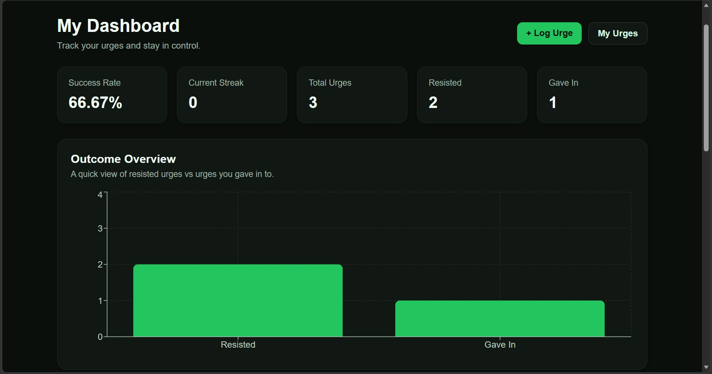
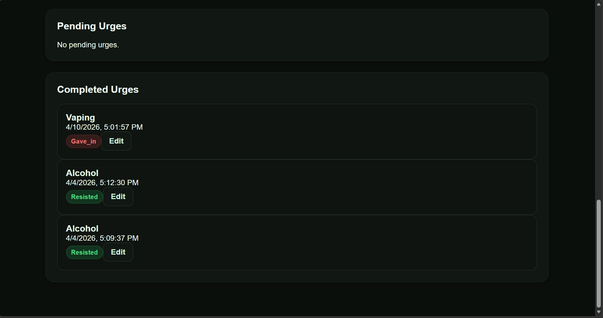
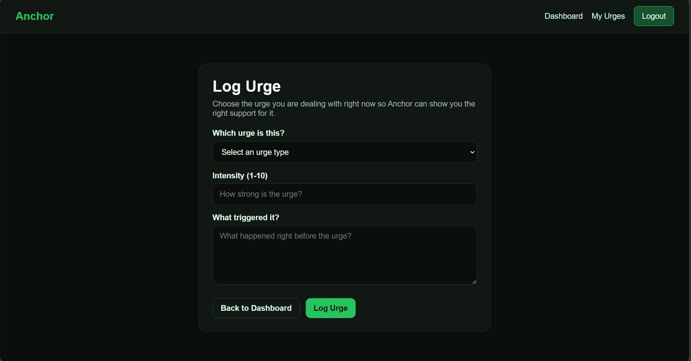
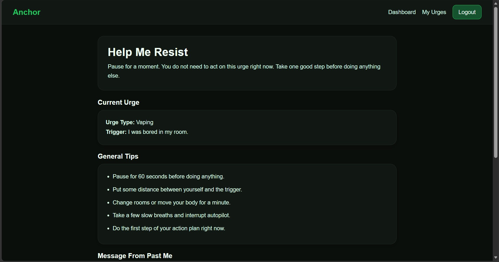
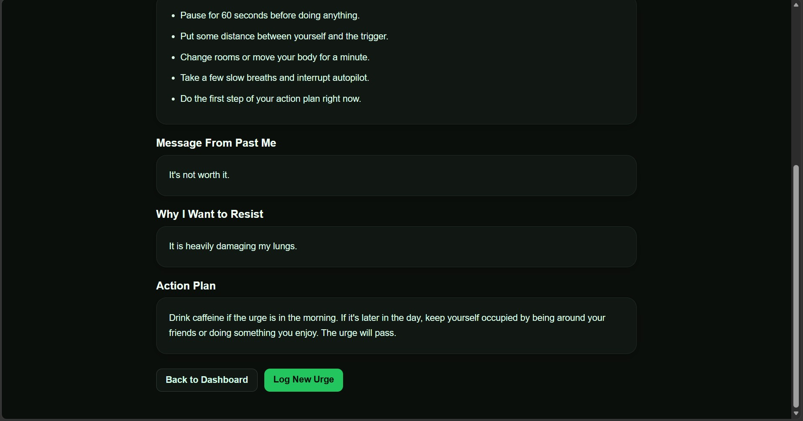
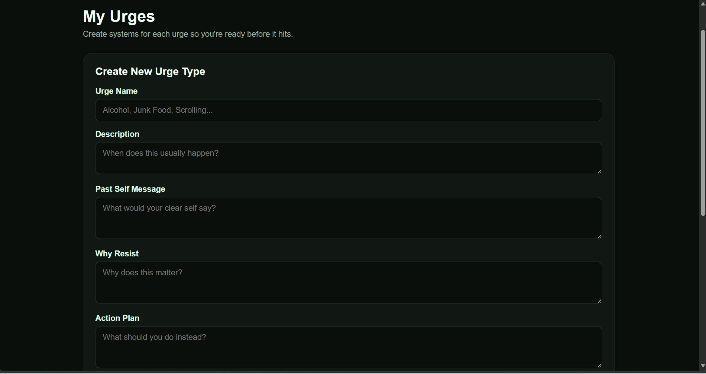
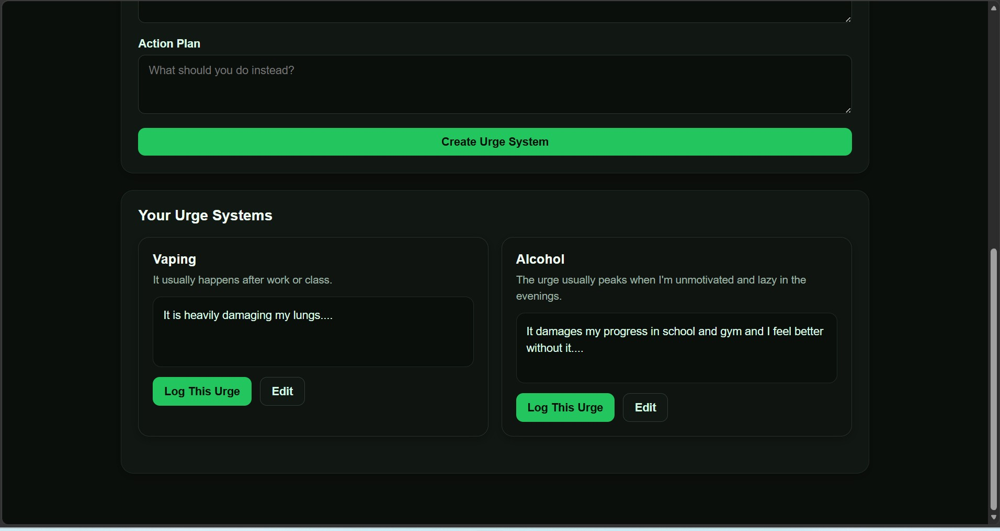

# Anchor


Anchor is a full-stack web application that helps users build self-discipline by tracking urges and encouraging reflection before making impulsive decisions. Rather than only focusing on streaks, the app reminds users of the goals, reasons, and commitments they created during moments of clarity, helping them stay accountable when an urge occurs.

---

## 🚀 Live Demo

**Try the app here:** https://anchor-frontend1.onrender.com

> This project is fully deployed on Render. Feel free to create an account and test all features.

## Screenshots

### Dashboard





---

### Log an Urge







---

### My Urges





---

## Features

- Secure user authentication using JWT
- User registration and login
- Create personalized urge templates
- Log urges whenever they occur
- View motivational messages, reasons, and action plans from your "past self"
- Mark urges as resisted or gave in
- Record reflections after each urge
- Dashboard with personal statistics and progress tracking
- View history of previous urges
- User-specific protected data
- Responsive interface built with React

---

## Tech Stack

### Frontend

- React
- Vite
- React Router
- Axios
- CSS

### Backend

- Flask
- SQLAlchemy
- Flask-JWT-Extended
- Flask-CORS
- bcrypt

### Database

- SQLite

---

## Project Structure

```
Anchor/
│
├── client/
│   ├── src/
│   ├── public/
│   └── package.json
│
├── server/
│   ├── app.py
│   ├── models.py
│   ├── routes/
│   ├── database.db
│   └── requirements.txt
│
├── screenshots/
│
├── LICENSE
└── README.md
```

---

## Installation

### Clone the repository

```bash
git clone https://github.com/YOUR_USERNAME/anchor.git
cd anchor
```

### Backend Setup

```bash
cd server

python -m venv venv
```

Windows

```bash
venv\Scripts\activate
```

Mac/Linux

```bash
source venv/bin/activate
```

Install dependencies

```bash
pip install -r requirements.txt
```

Run the Flask server

```bash
python app.py
```

The backend will start on:

```
http://localhost:5000
```

---

### Frontend Setup

Open a second terminal.

```bash
cd client

npm install

npm run dev
```

The frontend will run on:

```
http://localhost:5173
```

---

## How It Works

1. Create an account or log in.
2. Create one or more urge templates that include:
   - Your reason for resisting
   - A message from your past self
   - An action plan
3. Whenever an urge occurs, log it using one of your templates.
4. The app displays your personalized reminders before you make a decision.
5. Mark whether you resisted or gave in and record a reflection.
6. Track your progress over time using the dashboard.

---

## Future Improvements

- Email verification
- Password reset
- Mobile application
- Push notifications
- Cloud database deployment
- AI-generated motivational messages
- Achievement badges and milestones
- Data export

---

## Why I Built This

I wanted to create an application that goes beyond traditional habit trackers by emphasizing reflection and intentional decision-making. The idea behind Anchor is that decisions made during moments of clarity can serve as guidance during moments of temptation, helping users stay focused on their long-term goals.

---

## Author

**Vick Velumani**

Computer Science Student

Wayne State University

---

## License

This project is licensed under the MIT License. See the LICENSE file for more information.
